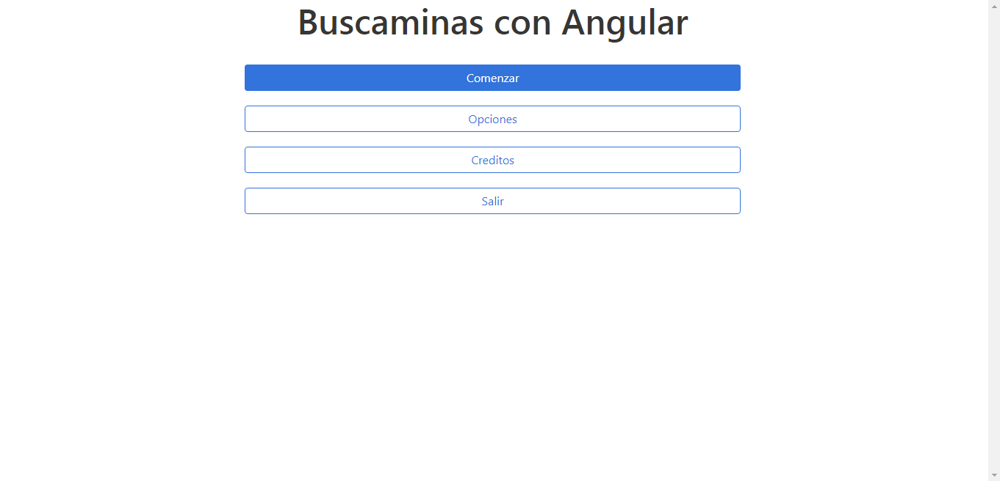
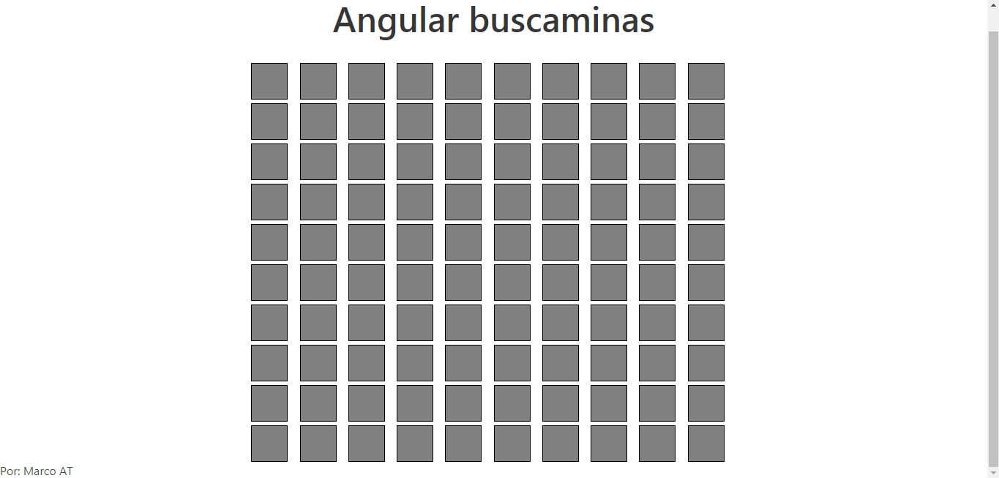
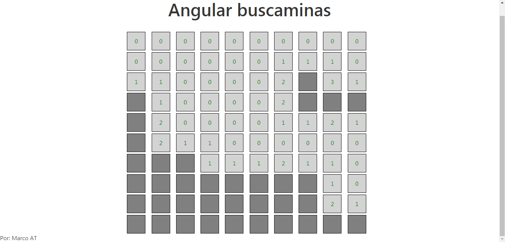
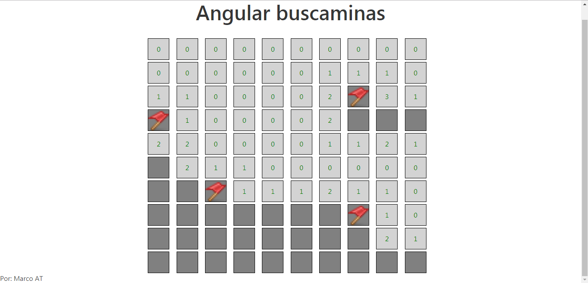
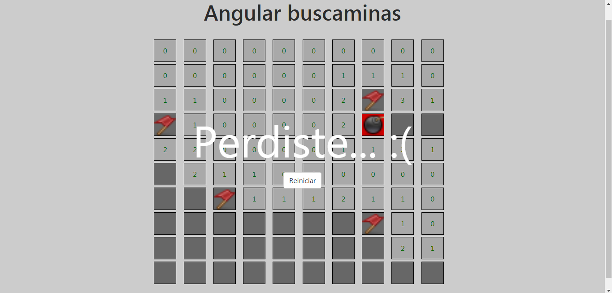
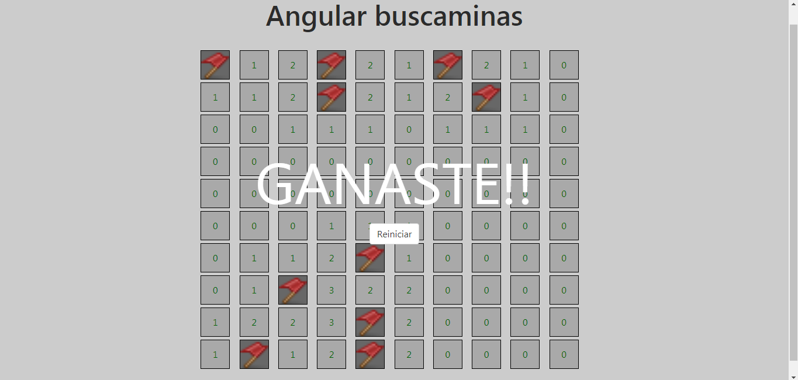

# Buscaminas con Angular 6

## Vista previa

Explorando los repositorios de Hithub me topé con uno que llamó mi atención. Se trababa de un repositorio llamado ["15-minute-apps"](https://github.com/mfitzp/15-minute-apps) creado por [Martin Fitzpatrick](https://github.com/mfitzp), el cual contiene una serie de "mini aplicaciones" creadas en Python usando [PyQt5](https://es.wikipedia.org/wiki/PyQt). Lellendo el código pensé que sería posible exportar algunas de ellas a la web usando [Angular](https://angular.io/) y de esa idea surgió esta pequeña aplicación.

## Objetivo general
Desarrollar las funcionalidades principales del clásico juego ["buscaminas"](https://es.wikipedia.org/wiki/Buscaminas) usando como herramienta principal [Angular](https://angular.io/) en su versión 6.

## "To do" de funcionalidades

- [x] Juego completamente funcional.
- [x] Menú que direccione a las diferentes vistas.
- [ ] Contador para el tiempo jugado.
- [ ] Tabla de puntuaciones.
- [ ] Almacenar puntuaciones en [Firebase](https://firebase.google.com/)
- [ ] Menú de opciones (modificar cantidad de minas, etc).
- [ ] Pantalla de créditos (Redundante pero ¿Por qué no? ;) )

## Capturas de pantalla

Los íconos usados en esta aplicación son cortesía de [Yusuke Kamiyaman](http://p.yusukekamiyamane.com/).

